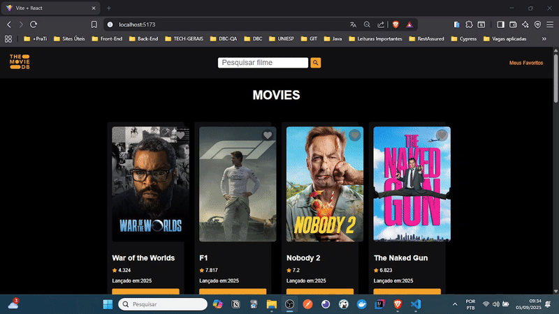

# 🎬 Projeto Filmes – React + TMDB API  

## 📸 Demonstração  

  
  

---

## 📖 Descrição  

Este projeto foi desenvolvido como desafio do **Módulo III da formação Full Stack Júnior - Codifica & +PraTi**.  
O objetivo é criar uma aplicação em **React.js** que consome a **API do TMDB (ou OMDb)**, permitindo que os usuários:  

- Busquem filmes.  
- Visualizem detalhes completos.  
- Montem e gerenciem uma lista de favoritos.  

---

## ⚙️ Funcionalidades  

✅ **Página de Busca** – Campo de texto + lista de resultados (pôster, título, ano, botão de detalhes).  
✅ **Paginação** – Navegação entre páginas de resultados.  
✅ **Página de Detalhes** – Exibe informações completas (diretor, elenco, sinopse, avaliação).  
✅ **Lista de Favoritos** – Adicionar/remover filmes, persistindo em **localStorage**.  
✅ **Loading & Erros** – Indicador de carregamento e mensagens de erro personalizadas.  

---

## 🛠️ Tecnologias Utilizadas  

- [React.js](https://react.dev/)  
- [Vite](https://vitejs.dev/)  
- [TMDB API](https://developer.themoviedb.org/docs/getting-started)  
- [React Router](https://reactrouter.com/)  
- [LocalStorage](https://developer.mozilla.org/pt-BR/docs/Web/API/Window/localStorage)  

---

## 🚀 Como executar o projeto  

### 🔑 Pré-requisitos  
- [Node.js](https://nodejs.org/) instalado.  
- Criar uma conta no [TMDB](https://developer.themoviedb.org/docs/getting-started) e gerar sua **API Key**.  

## 📥 Passo a passo

1 - Clonar o repositório

```bash
git clone git@github.com:Marcella-acrg/maisPraTi-2025-02.git
```

2 - Abrir o projeto em sua IDE de preferência (utilizei o VSCODE) e, em seguida, abrir o terminal da prórpia IDE e acessar o projeto por meio dos comandos: 

```bash
cd modulo03
``` 
```bash
cd desafio01
```

3 - Instalar dependências

`npm install`

4 - Configurar variáveis de ambiente
Na raiz do projeto, crie um arquivo .env com o conteúdo:

```bash
VITE_API_KEY=SUA_CHAVE_AQUI
VITE_API=https://api.themoviedb.org/3/
VITE_SEARCH=https://api.themoviedb.org/3/search/movie
VITE_IMG=https://image.tmdb.org/t/p/w500/
VITE_PROFILE=https://image.tmdb.org/t/p/w200/
```

5 - Rodar o projeto

`npm run dev`


## 📌 Melhorias Futuras

🔍 Implementar filtros (por gênero, ano, idioma).

🌙 Tema escuro/claro.


